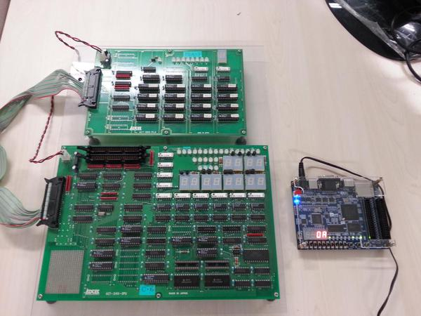

# 導入

## 授業の概要と目的

この「組込みシステム」の授業では、非常にシンプルなアーキテクチャを持つコンピュータCDECvの動作実験や設計実習を通して、コンピュータ内部の動作の仕組みと構造を体験的に学んででいきます。
みなさんはこれまで「ディジタル回路基礎」や「ディジタル回路」などの授業で、様々な論理回路の動作や構造、そしてその設計手法を学んできました。
この授業では、これまで学んできた各種の論理回路を組み合わせていくことで、実際にコンピュータ(CPU, MPU)を構築していきます。
実習で用いるコンピュータCDECvは様々なカスタマイズか可能で、例えばみなさん自身で考えた独自の命令を追加したりすることができます。
世界で一つだけの皆さんオリジナルのコンピュータを作ることができる、とてもエキサイティングで楽しい授業になるかと思います。

## CDECvとは

CDECv (Yet another CDEC, CDEC Voyager) はコンピュータアーキテクチャを学ぶために開発された、非常にシンプルなアーキテクチャを持つ8ビットコンピュータボードです。
CDECvのオリジナルは、木村真也氏(群馬工業高等専門学校教授)と鹿股昭雄氏(元　仙台高等専門学校教授)により開発されたコンピュータボードCDEC(Computer Design Education Computer)です。
CDECvはCDECをFPGAの評価ボード(DE0-CV)上で実装できるように修正したものですが、そのアーキテクチャや構造はオリジナルのCDECのものを引き継いでいます。

<図0.1 CDEC(左)とCDECv(右)>

CDECvは以下に示す特徴を持った、コンピュータアーキテクチャ教育用のコンピュータボードです。
- 非常にシンプルなアーキテクチャである(5個のレジスタセットと256バイトのメモリ)
- シンプルかつプログラミングを行うのに十分な命令セットをもつ
- 1クロック単位でコンピュータ内部のデータのやり取りを観察することができる
- コンピュータ内部は大きく分けて、データパス部と制御部からなる
- データパス部は1本のデータバスで構成される非常に単純な構造である
- 制御部の論理回路を改造することで新たな命令を追加することができる

CDECvはterasic社のFPGA評価ボードDE0 CVに搭載されたFPGA(Cyclone V)上に実装することができます。
DE0 CVボードのスイッチやボタン、LEDなどの入出力デバイスによって、CDECvの1クロック毎でのプログラムの実行を行うことができるようになっています。

また、CDECvはVerilog HDLによって設計されています。
したがって、Verilog HDLの記述を変更することによってCDECvの動作を変更することができます。
変更した回路情報をDE0 CVボードに書き込むことで、変更した新たな動作を確認できます。
