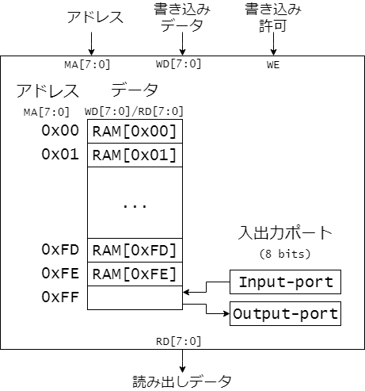

# CDECvのアーキテクチャ設計
本章では実習で用いるコンピュータCDECvのアーキテクチャ仕様を規定します。

ここで出てきたアーキテクチャとは、プログラマから見えるコンピュータの仕様のことです。具体的には利用できるレジスタの構成や、メモリ空間、入出力、および命令などの一式を指します。

これに対し、コンピュータのハードウェア的な構造や具体的な実現方法は、マイクロアーキテクチャ（ハードウェアアーキテクチャ、インプリメンテーション）と呼ばれます。

アーキテクチャはそのコンピュータのソフトウェア的なインタフェースを定めるため、同じアーキテクチャのコンピュータであれば、その実現方法すなわちマイクロアーキテクチャが異なっていても、同じプログラムをそのまま実行することができます。

## レジスタセット
CDECvでプログラマが直接意識しないといけないレジスタは、汎用レジスタ3個、プログラムカウンタ、フラグレジスタの計5個です。

1. 汎用レジスタ(A, B, C)
データ保持用のレジスタとして8ビットのレジスタが3個あります。それぞれの名称をA, B, Cとします。

2. プログラムカウンタ
プログラウカウンタは実行中の機械語命令が格納されているメモリ空間のアドレスを保持するレジスタです。名称をPCとします。

3. フラグレジスタ
加減算命令で繰り上がり処理や、演算を行った結果により処理の流れを変える場合の判定に用いられます。
名称をFLGとします。

フラグレジスタは下記の3ビットのみが有効です。
 - S(FLG3)はサインフラグです。演算結果の最上位ビットMSBが1の場合に1となり、0の場合に0となります。
 - Z(FLG2)はゼロフラグです。演算結果が0となった場合に1となり、0以外の場合に0となります。
 - Cy(FLG1)はキャリーフラグです。演算命令において演算結果の最上位ビットからの繰り上がりがある場合に1となり、繰り上がりがない場合に0となります。


<図1.1 CDECvのレジスタセット>


## メモリ空間
CDECvのプログラム(機械語命令)やデータはメモリに格納されます。CDECvのメモリ空間は8ビットを1アドレスとして、0x00番地(0番地)から0xFF番地(255番地)までの計256バイトとなります。
アドレスを指定することで、その番地のデータへのアクセス（書き込みと読み出し）が可能となります。

256バイトのメモリ空間のうち、0x00番地から0xFE番地までは通常のデータの読み書きができるRAM領域です。残りの0xFF番地は入出力用のIOポートにアクセスするための番地になっています。すなわち0xFF番地にデータを書き込むことで出力ポートにデータを書き込むことができます。同様に0xFF番地のデータを読み込むことで入力ポートに保持されているデータを読み込むことができます。



<図1.2 CDECvのメモリ空間>


## 標準命令セット
CDECvでは機械語の命令セットを利用者が自由に決定することができます。
ただし、ここではコンピュータアーキテクチャ設計の学習を容易にするため、以下に示す各種命令を標準命令セットとして定めました。
学習者はこれらの標準命令を参考にして、命令を変更したり、独自に定めた新たな命令を追加したりすることができます。

標準命令のニーモニック、命令コード、フラグ変化、動作記述、意味を表1.1に示します。

<表1.1 CDECvの標準命令>

| ニーモニック    | 命令コード     | フラグ変化 | 動作記述           | 意味 |
|----------------|---------------|:----:|------------------------|------|
|`MOV sreg, dreg`|`000xssdd`     |  --  | dreg <- sreg           | move register to register |
|`LD  adrs, dreg`|`100xxxdd adrs`|  --  | dreg <- MEM[adrs]      | load memory to register |
|`ST  sreg, adrs`|`101xssxx adrs`|  --  | MEM[adrs] <- sreg      | store register to memory |
|`ADD reg       `|`001000rr`     |  @   | A <- A + reg           | add |
|`ADC reg       `|`001001rr`     |  @   | A <- A + reg + Cy      | add with carry |
|`SUB reg       `|`001010rr`     |  @   | A <- A - reg           | subtract |
|`SBB reg       `|`001011rr`     |  @   | A <- A - reg - Cy      | subtract with borrow |
|`AND reg       `|`001100rr`     |  @   | A <- A & reg           | logical and (bitwise) |
|`OR  reg       `|`001101rr`     |  @   | A <- A \| reg          | logical or (bitwise) |
|`EOR reg       `|`001111rr`     |  @   | A <- A ^ reg           | logical exclusive or (bitwise) |
|`INC reg       `|`010000rr`     |  @   | reg <- reg + 1         | incriment |
|`DEC reg       `|`010001rr`     |  @   | reg <- reg - 1         | decrement |
|`NOT reg       `|`010100rr`     |  @   | reg <- ~reg            | logical not (bitwise) |
|`JMP adrs      `|`110xxx00 adrs`|  --  | PC <- adrs             | jump |
|`JS adrs       `|`111100xx adrs`|  --  | if (S == 1) PC <- adrs else PC <- PC + 2 | jump if S == 1 |
|`JZ adrs       `|`111010xx adrs`|  --  | if (Z == 1) PC <- adrs else PC <- PC + 2 | jump if Z == 1 |
|`JC adrs       `|`111001xx adrs`|  --  | if (Cy == 1) PC <- adrs else PC <- PC + 2 | jump if Cy == 1 |

[注1]　命令コード中の`x`は将来の拡張のため0とします。

[注2] フラグ変化の@は演算結果によりすべてのフラグが影響を受けることを示しています。


命令コード中の`ss`, `dd`, `rr`は、ニーモニックで指定される汎用レジスタ`sreg`, `dreg`, `reg`を示す2ビットの符号で、表1.2により定義されます。

<表1.2 レジスタ指定符号>

| reg/sreg/dreg | rr/ss/dd |
|:-------------:|:--------:|
| A             |`01`      |
| B             |`10`      |
| C             |`11`      |


標準命令の大まかな分類は次のようになります。

1. データ転送命令
    - レジスタ間データ転送(MOV)
    - メモリからレジスタへのロード(LD)
    - レジスタからメモリへのストア(ST)
2. 算術論理演算命令
    - 算術演算
        * 1オペランド命令(INC, DEC):指定されたレジスタのインクリメントやデクリメントを行います
        * 2オペランド命令(ADD, ADC, SUB, SBB):Aレジスタをアキュムレータとして固定し、指定されたレジスタとの加減算を行います
    - 論理演算
        * 1オペランド命令(NOT):指定されたレジスタの論理否定を行います
        * 2オペランド命令(AND, OR, EOR):Aレジスタをアキュムレータとして固定し、指定されたレジスタとの論理演算を行います
3. 分岐命令
    - 無条件分岐(JMP)
    - 条件付き分岐(JS, JZ, JC):フラグの値により分岐先を変更します

なお、メモリ空間のアドレスを指定するロード(LD)、ストア(ST)命令、および分岐命令(JMP, JS, JZ, JC)の命令コードは、1バイトのオペコードと8ビット(1バイト)のアドレス指定(adrs)から構成される2バイト命令となります。
他の標準命令は1バイト命令です。


## リセット動作

CDECvへリセット信号が入力されると、CDECvは実行中の動作を中断してリセット状態になります。リセット状態ではプログラムカウンタが0になります。他のレジスタの値は変更されません。

リセット信号を解除すると、CDECvはメモリ空間の0x00番地(0番地)から命令の実行を開始します。


## 特殊な命令

標準命令セットには含まれませんが、プログラムの実行を停止する特殊な命令として、表1.3に示すHALT命令を追加します。

<表1.3 HALT命令>

| ニーモニック    | 命令コード     | フラグ変化 | 動作記述               |
|----------------|---------------|:---------:|-----------------------|
|`HALT`          |`11111111`     |  --       | 命令の実行を停止する    |


## CDECvサンプルプログラム

CDECvの標準命令セットによるプログラム例を示します。

### 1~nの合計を計算するプログラム

メモリの0x0A番地の値を正の数とみなし、1からその数までの合計を計算し、結果を0xB0、0xB1番地に格納するプログラムをリスト1.1に示します。
参考のために、プログラムを機械語命令に翻訳したものをリストの右半分にコメントとして示しておきます。

<リスト1.1 シグマ計算>

```
; sample program : sigma
                                  ; address code
          ORG       0x00             
          LD        ZERO, A       ;   00    81 A1
          MOV       A, B          ;   02    06
          LD        DATA, C       ;   03    83 A0
;
LOOP:     ADD       C             ;   05    23
          JC        CRYUP         ;   06    E4 0D
CNTDN:    DEC       C             ;   08    47
          JZ        LPEND         ;   09    E8 10
          JMP       LOOP          ;   0B    C0 05
CRYUP:    INC       B             ;   0D    42
          JMP       CNTDN         ;   0E    C0 08
LPEND:    ST        A, RSLT0      ;   10    A4 B0
          ST        B, RSLT1      ;   12    A8 B1
STOP:     JMP       STOP          ;   14    C0 14
;
          ORG       0xA0
DATA:     DB        0x0C          ;   A0    0C          
ZERO:     DB        0x00          ;   A1    00
;
          ORG       0xB0
RSLT0:    DB        0x00          ;   B0    00
RSLT1:    DB        0x00          ;   B1    00
;
          END
```

セミコロン";"から続く文字列はその行の終わりまでがコメントであることを示します。
コメントはプログラマにとって便利な注釈をつけるために利用できます。
アセンブラはコメントを無視します。

`ORG`や`DB`、`END`はCDECvで実行される命令ではなく、アセンブラへプログラムの構造について補助的な情報を与える疑似命令です。表1.4に疑似命令の意味を示します。

<表1.4 疑似命令>

| ニーモニック    | 意味          |
|----------------|---------------|
|`ORG adrs`      |直後の命令がadrsで示される番地に格納されている|
|`DB data`       |1バイトのデータdataをメモリに格納する|
|`END`           |プログラムの終わりを示す|

例えば、リスト1.1中の`ORG 0x00`は、その直後のLD命令がメモリの0x00番地に格納されることを示します。また、`ORG 0xA0`とそれに引き続く`DB 0x0A`は、メモリの0x0A番地に1バイトのデータ0x0Cを格納することを表しています。


`LOOP`や`CNTDN`、`DATA`など、プログラム中でコロン":"がつけられた変数はラベルです。ラベルは直後の命令が格納されているメモリの番地を参照するための別名です。
例えば、ラベル`LOOP`は、`LOOP:`の直後の`ADD C`という命令が0x05番地に格納されていますので、0x05という値(番地)を示します。
同様に`CTNDN`は0x08、`DATA`は0x0Aという値を示しています。
ラベルはプログラム中でメモリの番地の別名として利用することができます。
例えばラベル`LOOP`を含んだ`JMP LOOP`という命令は`JMP 0x05`と同じ意味です。


### ビットカウント

メモリの0xFF番地の値、すなわち入力ポートの値について、各ビットの1の数をカウントし、そのカウント数をメモリの0xB0番地に格納するプログラムをリスト1.2に示します。

<リスト1.2 ビットカウント>

```
; sample program: bit count
          ORG       0x00
          LD        ZERO, B
          LD        0xFF, A
;
LOOP:     ADD       A
          JC        COUNT
          JZ        STORE
          JMP       LOOP
COUNT:    INC       B
          JMP       LOOP
;
STORE:    ST        B, RSLT
STOP:     JMP       STOP
;
          ORG       0xA0
ZERO:     DB        0x00
;
          ORG       0xB0
RSLT:     DB        0x00
;
          END
```

## 演習問題

1. メモリマップトI/Oという用語について調査を行い、それがCDECvにおいてどのように活用されているか、説明してみましょう。

2. リスト1.1のプログラムの流れを、フローチャートなどを作成して確認してみましょう。

3. リスト1.2のプログラムを手動で機械語へ変換してみましょう(ハンドアセンブル)。

4. CDECvのプログラムを機械語へ翻訳するアセンブラを作成しましょう。アセンブラが満たしているべき必須条件と、満たすことが望まれる推奨条件を示します。
    - 必須条件:
        - CDECvの標準命令セットとHALT命令に対応していること
        - 疑似命令 ORG, DB, ENDに対応していること
        - ラベルが利用できること
    - 推奨条件:
        - コメントに対応していること(コメントを無視できること)
        - 新たな追加命令に対応できる拡張性を備えていること
        - 機械語命令のコード列をインテルHEX形式に変換して出力できること
