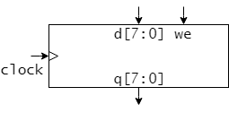
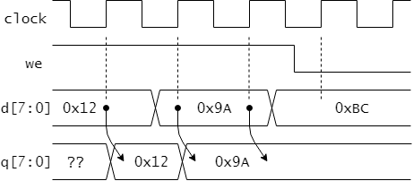
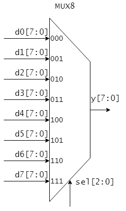
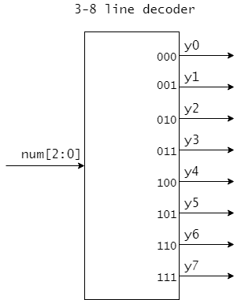
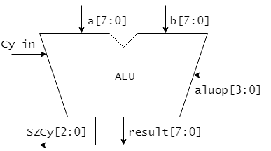

# CDECvを構成する様々な回路要素

## レジスタ
レジスタは順序回路を構成するもっとも基本的な記憶回路です。
CDECvでは、レジスタセットの汎用レジスタ、プログラムカウンタ、フラグレジスタや、他の補助的なレジスタ、それからIOポートなどに用いられています。
また、制御信号を生成するための状態機械を実装するためにも用いられます。

ここでは、図2.1に示す書き込み許可付き8ビットレジスタの構成と動作を説明します。



<図2.1 書き込み許可付き8ビットレジスタ>

端子dからは8ビットのデータが入力されます。
書き込み許可weに1(アサート)が入力されている場合、クロック信号clockの立ち上がりのタイミングで入力dのデータを取り込み、内部にデータを保持します。
保持された8ビットのデータは出力端子qより出力されます。

書き込み許可weが0となっている場合はデータの取り込みは行われません。
この場合(we=0)は、クロック信号clockの立ち上がりが入ったとしても、保持されたデータは変化しません。(qの値は変化しません)

このレジスタの動作例を図2.2に示します。




<図2.2 書き込み許可付き8ビットレジスタの動作例>


Verilog HDLで書き込み許可付き8ビットレジスタを設計した記述例をリスト2.1に示します。

<リスト2.1 書き込み許可付き8ビットレジスタの Verilog HDL 記述例>

````Verilog
module register ( // positive edge clock
  input wire        clock,
  input wire        we,
  input wire [7:0]  d,
  output reg [7:0]  q
  );

  always @ (posedge clock) begin
    if (we) begin
      q <= d;                 // write data
    end else begin
      q <= q;                 // keep
    end
  end
endmodule
````


## メモリ

メモリはプログラムやデータを保持しておくための記憶装置です。
メモリ内部の記憶領域を構成する各ビットは、ワード(例えば8ビット=1バイト)を単位に区切られ、各ワードにはアドレスが割り振られています。
アドレスを指定することで、そのアドレスを持つワードの記憶領域へアクセスし、データの読み書きをすることができます。

図2.3にCDECvで用いている、1ワードが8ビット(1バイト)、アドレスも8ビットで指定されるメモリを示します。
アドレスが8ビットで指定されますので、メモリ内部の記憶領域の各ワードは0x00番地から0xFF番地までの256個のアドレスで指定されます。
MAはアドレスを指定する8ビットの入力端子、WDは書き込み用の入力データを指定する8ビットの入力端子です。
8ビットの出力端子RDにはMAで指定されたアドレスのデータが出力されます。
weは書き込み許可信号で、weが1の時にメモリへのデータの書き込みが許可されます。
また、このメモリはクロック信号clockに同期して動作し、データの読み書きはclockの立ち上がりのタイミングで行われます。

それでは、図2.4のメモリの動作例をもとに、メモリの動作を説明します。
ここでは、アドレスaddrで指定されるワードに保持されているデータをRAM[addr]で表記することにします。
例えば0xA0番地に保持されているデータはRAM[0xA0]と表します。
図2.4では、0xA0, 0xA1, 0xA2番地へのデータアクセスの動作例が示されています。
なお初期状態においては、RAM[0xA0]=0x11, RAM[0xA1]=0x22, RAM[0xA2]=0x33であるとしています。

最初のclockの立ち上がりタイミングでは、MAが0xA0となっていますので、0xA0番地のデータ(RAM[0xA0])である0x11がRDに読みだされます。
なお、WDには0x12という値が設定されていますが、weが0で書き込み不可となっていますので、RAM[0xA0]へのデータの書き込みは行われません。

2番目のclockの立ち上がりのタイミングでは、MAに0xA1が指定されていますので、RAM[0xA1]の値0x22がRDに読みだされています。

3番目のclockの立ち上がりのタイミングでは、MAは変わらず0xA1が指定されていますが、weが1と書き込み許可となっていますので、このタイミングでWDの値0x12がRAM[0xA1]に書き込まれます。
なお、RDにはRAM[0xA1]が更新される前の値0x22が出力されます。

4番目のclockの立ち上がりのタイミングでは、MAに0xA2が指定されていますので、RAM[0xA2]へのアクセスが行われます。
weが1ですので、RAM[0xA2]の読出しに加え、RAM[0xA2]への書き込みの両方が行われます。


<図2.3 メモリ>


<図2.4 メモリの動作例>


リスト2.2にメモリのVerilog HDLの記述例を示します。


<リスト2.2 メモリの Verilog HDL 記述例>

````Verilog
module memory ( // positive edge clock
  input wire        clock,
  input wire        we, // write enable
  input wire [7:0]  MA, // address      (Memory Adress)
  input wire [7:0]  WD, // input data   (Write Data)
  output reg [7:0]  RD  // output data  (Read Data)
  );

  reg [7:0] RAM [255:0];

  always_ff @(posedge clock) begin
    if (we) RAM[MA] <= WD;
    RD <= RAM[MA];
  end
endmodule
````

## マルチプレクサ

マルチプレクサは複数の入力信号のうち一つを選びそれを出力する組み合わせ論理回路です。
どの入力信号を出力させるのかは、選択信号により選び切り替えることができます。
CDECvでは、レジスタ間でのデータ転送を行う際に、転送元のレジスタを選択するためにマルチプレクサが利用されています。

図2.5に8個の入力信号から1つを選択して出力するマルチプレクサ(mux8)を示します。
d0からd7までは各8ビットの入力端子、yは8ビットの出力端子です。
3ビットの選択信号selは、d0からd7のどれをyに出力するかを定めます。

表2.1にこのマルチプレクサ(mux8)の機能表を示します。
例えば、3ビットの選択信号selが011と入力されている場合、入力信号のうちd3が選択されyに出力されます。

<図2.5 8入力マルチプレクサ>




<表2.1 8入力マルチプレクサの機能表>

|sel[2:0]| y  |
|--------|----|
| 000    | d0 |
| 001    | d1 |
| 010    | d2 |
| 011    | d3 |
| 100    | d4 |
| 101    | d5 |
| 110    | d6 |
| 111    | d7 |


リスト2.3にマルチプレクサのVerilog HDL 記述例を示します。

<リスト2.3 8入力マルチプレクサのVerilog HDL 記述例>

````Verilog
module mux8 # (parameter WIDTH = 8) (
  input wire  [2:0]       sel,
  input wire  [WIDTH-1:0] d0,
  input wire  [WIDTH-1:0] d1,
  input wire  [WIDTH-1:0] d2,
  input wire  [WIDTH-1:0] d3,
  input wire  [WIDTH-1:0] d4,
  input wire  [WIDTH-1:0] d5,
  input wire  [WIDTH-1:0] d6,
  input wire  [WIDTH-1:0] d7,
  output reg  [WIDTH-1:0] y  
  );

  always @ (*) begin
    case (sel)
      3'b000: y = d0;
      3'b001: y = d1;
      3'b010: y = d2;
      3'b011: y = d3;
      3'b100: y = d4;
      3'b101: y = d5;
      3'b110: y = d6;
      3'b111: y = d7;
    endcase
  end
endmodule

````


## デコーダ

デコーダは符号化された入力信号を受け取り、入力信号を適切に復号化して出力する組み合わせ論理回路です。

様々な種類のデコーダが考えられますが、ここでは図2.6に示す、3-8ラインデコーダについて考えていきます。
3-8ラインデコーダは3ビットの入力端子numと、y0からy7までの8個の1ビットの出力端子を持ちます。
入力numを3ビットの2進数とみなし、その数と対応する出力端子のみに1を出力し、その他の出力端子には0を出力します。
例えば、numとして011が入力された場合は、y3に1を出力し、その他のy0, y1, y2, y4, y5, y6, y7には0を出力します。
この3-8ラインデコーダの真理値表を表2.2に示します。

CDECvでは、レジスタ間でのデータ転送を行う際に、転送先のレジスタを1つ選び、そのレジスタへ書き込み許可信号を送るために、ラインデコーダが利用されています。




<図2.6 3-8ラインデコーダ>


<表2.2 3-8ラインデコーダの真理値表>

| num | y7 | y6 | y5 | y4 | y3 | y2 | y1 | y0 |
|-----|----|----|----|----|----|----|----|----|
| 000 |  0 |  0 |  0 |  0 |  0 |  0 |  0 |  1 |
| 001 |  0 |  0 |  0 |  0 |  0 |  0 |  1 |  0 |
| 010 |  0 |  0 |  0 |  0 |  0 |  1 |  0 |  0 |
| 011 |  0 |  0 |  0 |  0 |  1 |  0 |  0 |  0 |
| 100 |  0 |  0 |  0 |  1 |  0 |  0 |  0 |  0 |
| 101 |  0 |  0 |  1 |  0 |  0 |  0 |  0 |  0 |
| 110 |  0 |  1 |  0 |  0 |  0 |  0 |  0 |  0 |
| 111 |  1 |  0 |  0 |  0 |  0 |  0 |  0 |  0 |


リスト2.4に3-8ラインデコーダのVerilog HDLによる記述例を示します。

<リスト2.4 3-8ラインデコーダの Verilog HDL 記述例>

````Verilog
module line_decoder ( // 3 to 8 line decoder
  input wire  [2:0]       num,
  output wire             y0
  output wire             y1
  output wire             y2
  output wire             y3
  output wire             y4
  output wire             y5
  output wire             y6
  output wire             y7
  );

  reg [7:0] ys;

  assign {y7, y6, y5, y4, y3, y2, y1, y0} = ys;

  always @ (*) begin
    case (num)
      3'b000: ys = 8'b0000_0001;
      3'b001: ys = 8'b0000_0010;
      3'b010: ys = 8'b0000_0100;
      3'b011: ys = 8'b0000_1000;
      3'b100: ys = 8'b0001_0000;
      3'b101: ys = 8'b0010_0000;
      3'b110: ys = 8'b0100_0000;
      3'b111: ys = 8'b1000_0000;
    endcase
  end
endmodule
````


## ALU (Arithmetic Logic Unit)




<図2.7 CDECvで使用するALU>


<表2.3 ALUの入出力端子の働き>

| 端子名  | 入出力 |   |
|--------|--------|---|
| a[7:0] | 入力 | 8ビットの入力データ |
| b[7:0] | 入力 | 8ビットの入力データ |
| Cy_in  | 入力 | 1ビットの入力データ(carry) |
| aluop[3:0]  | 入力 | ALUで行う演算を選択する選択信号(表2.4を参照) |
| result[7:0] | 出力 | a,bに対する演算結果(8ビット) |
| SZCy[2:0]   | 出力 | 演算結果に依存したフラグ信号 |


<表2.4 ALUの機能表>

| aluop | 機能　(resultへの出力) |
|-------|------|
|  0000 |    a |
|  0001 |    b |
|  0010 |    ~a (bitwise not) |
|  0011 |    ~b (bitwise not) |
|  0100 | a & b (bitwise and) |
|  0101 | a \| b (bitwise or)  |
|  0110 | a ^ b (bitwise exclusive or) |
|  0111 | 8'b0000_0000 |
|  1000 | a + 1 |
|  1001 | a - 1 |
|  1010 | a + b |
|  1011 | a - b |
|  1100 | a + b + Cy_in (add with carry)       |
|  1101 | a - b - Cy_in (subtract with borrow) |
|  1110 | a << 1 (shift left)                  |
|  1111 | a >> 1 (logical shift right)         |


<リスト2.5 ALUの Verilog HDL 記述例>

````Verilog
module alu(
  input wire  [3:0] aluop,
  input wire  [7:0] a,
  input wire  [7:0] b,
  input wire        Cy_in,
  output wire [7:0] result,
  output wire [2:0] SZCy
  );

  reg [8:0] result1;
  wire S, Z, Cy;

  assign result = result1[7:0];
  assign S      = result1[7];
  assign Z      = (result1[7:0] == 8'h00) ? 1'b1 : 1'b0;
  assign Cy     = result1[8];
  assign SZCy   = {S, Z, Cy};

  always @ (*) begin
    casex (aluop)
      4'b0000: result1 = a;
      4'b0001: result1 = b;
      4'b0010: result1 = ~a;
      4'b0011: result1 = ~b;
      4'b0100: result1 = a & b;
      4'b0101: result1 = a | b;
      4'b0110: result1 = a ^ b;
      4'b0111: result1 = 8'b0000_0000;
      4'b1000: result1 = a + 1'b1;
      4'b1001: result1 = a - 1'b1;
      4'b1010: result1 = a + b;
      4'b1011: result1 = a - b;
      4'b1100: result1 = a + b + Cy_in;
      4'b1101: result1 = a - b - Cy_in;
      4'b1110: result1 = {a, 1'b0};
      4'b1111: result1 = {2'b00, a[7:1]};  
    endcase
  end
endmodule

````
