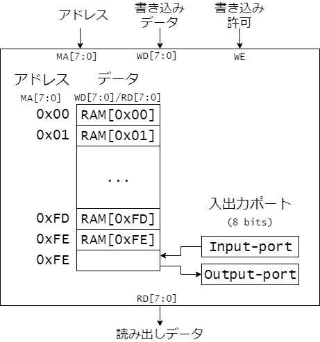

# CDECvを構成する様々な回路要素

## レジスタ
レジスタは順序回路を構成するもっとも基本的な回路です。
CDECvでは、レジスタセットの汎用レジスタ、プログラムカウンタ、フラグレジスタや、他の補助的なレジスタそれからIOポートなどに用いられています。
他にも、制御信号を生成するための状態機械を実装するためにも用いられます。

ここでは、図2.1に示す書き込み許可付き8ビットレジスタの構成と動作を説明します。


<図2.1 書き込み許可付き8ビットレジスタ>

端子dからは8ビットのデータが入力されます。
書き込み許可weに1(アサート)が入力されている場合、クロック信号clockの立ち上がりのタイミングで入力dのデータを取り込み、内部にデータを保持します。
保持された8ビットのデータは出力端子qより出力されます。

書き込み許可weが0となっている場合はデータの取り込みは行われません。
この場合(we=0)は、クロック信号clockの立ち上がりが入ったとしても、保持されたデータは変化しません。(qの値は変化しません)

このレジスタの動作例を図2.2に示します。

<リスト2.1 書き込み許可付き8ビットレジスタの Verilog HDL 記述例>


Verilog HDLで書き込み許可付き8ビットレジスタを設計した記述例をリスト2.1に示します。

<図2.2 書き込み許可付き8ビットレジスタの動作例>

````Verilog
module register ( // positive edge clock
  input wire        clock,
  input wire        we,
  input wire [7:0]  d,
  output reg [7:0]  q
  );

  always @ (posedge clock) begin
    if (we) begin
      q <= d;                 // write data
    end else begin
      q <= q;                 // keep
    end
  end
endmodule
````


## メモリ

メモリはアドレス付けされたデータ



<図2.3 メモリ>


<図2.4 メモリの動作例>


<リスト2.2 メモリのHDL記述例>

````Verilog
module memory ( // positive edge clock
  input wire        clock,
  input wire        we, // write enable
  input wire [7:0]  MA, // address      (Memory Adress)
  input wire [7:0]  WD, // input data   (Write Data)
  output reg [7:0]  RD  // output data  (Read Data)
  );

  reg [7:0] RAM [255:0];

  always_ff @(posedge clock) begin
    if (we) RAM[MA] <= WD;
    RD <= RAM[MA];
  end
endmodule
````
