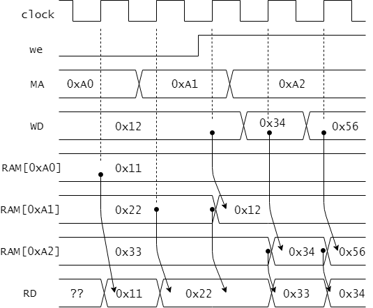

# CDECvを構成する様々な回路要素

## レジスタ
レジスタは順序回路を構成するもっとも基本的な回路です。
CDECvでは、レジスタセットの汎用レジスタ、プログラムカウンタ、フラグレジスタや、他の補助的なレジスタそれからIOポートなどに用いられています。
他にも、制御信号を生成するための状態機械を実装するためにも用いられます。

ここでは、図2.1に示す書き込み許可付き8ビットレジスタの構成と動作を説明します。


<図2.1 書き込み許可付き8ビットレジスタ>

端子dからは8ビットのデータが入力されます。
書き込み許可weに1(アサート)が入力されている場合、クロック信号clockの立ち上がりのタイミングで入力dのデータを取り込み、内部にデータを保持します。
保持された8ビットのデータは出力端子qより出力されます。

書き込み許可weが0となっている場合はデータの取り込みは行われません。
この場合(we=0)は、クロック信号clockの立ち上がりが入ったとしても、保持されたデータは変化しません。(qの値は変化しません)

このレジスタの動作例を図2.2に示します。


<図2.2 書き込み許可付き8ビットレジスタの動作例>


Verilog HDLで書き込み許可付き8ビットレジスタを設計した記述例をリスト2.1に示します。

<リスト2.1 書き込み許可付き8ビットレジスタの Verilog HDL 記述例>

````Verilog
module register ( // positive edge clock
  input wire        clock,
  input wire        we,
  input wire [7:0]  d,
  output reg [7:0]  q
  );

  always @ (posedge clock) begin
    if (we) begin
      q <= d;                 // write data
    end else begin
      q <= q;                 // keep
    end
  end
endmodule
````


## メモリ

メモリはプログラムやデータを保持しておくための記憶装置です。
メモリ内部の記憶領域を構成する各ビットは、ワード(例えば8ビット=1バイト)を単位に区切られ、各ワードにはアドレスが割り振られています。
アドレスを指定することで、そのアドレスを持つワードの記憶領域へアクセスし、データの読み書きをすることができます。

図2.3にCDECvで用いている、1ワードが8ビット(1バイト)、アドレスも8ビットで指定されるメモリを示します。
アドレスが8ビットで指定されますので、メモリ内部の記憶領域の各ワードは0x00番地から0xFF番地までの256個のアドレスで指定されます。
MAはアドレスを指定する8ビットの入力端子、WDは書き込み用の入力データを指定する8ビットの入力端子です。
8ビットの出力端子RDにはMAで指定されたアドレスのデータが出力されます。
weは書き込み許可信号で、weが1の時にメモリへのデータの書き込みが許可されます。
また、このメモリはクロック信号clockに同期して動作し、データの読み書きはclockの立ち上がりのタイミングで行われます。

それでは、図2.4のメモリの動作例をもとに、メモリの動作を説明していきます。
ここで、アドレスaddrで指定されるワードに保持されているデータをRAM[addr]で表記することにします。
例えば0xA0番地に保持されているデータはRAM[0xA0]と表されます。
図2.4では、0xA0, 0xA1, 0xA2番地へのデータアクセスの動作例が示されています。
なお初期状態においては、RAM[0xA0]=0x11, RAM[0xA1]=0x22, RAM[0xA2]=0x33であるとしています。

最初のclockの立ち上がりタイミングでは、MAが0xA0となっていますので、0xA0番地のデータ(RAM[0xA0])である0x11がRDに読みだされます。
なお、WDには0x12という値が設定されていますが、weが0で書き込み不可となっていますので、RAM[0xA0]へのデータの書き込みは行われません。

2番目のclockの立ち上がりのタイミングでは、MAに0xA1が指定されていますので、RAM[0xA1]の値0x22がRDに読みだされています。

3番目のclockの立ち上がりのタイミングでは、MAは変わらず0xA1が指定されていますが、weが1と書き込み許可となっていますので、このタイミングでWDの値0x12がRAM[0xA1]に書き込まれます。
なお、RDにはRAM[0xA1]が更新される前の値が出力されています。

3番目のclockの立ち上がりのタイミングでは、MAに0xA2が指定されていますので、RAM[0xA2]からの読出しと、RAM[0xA2]への書き込みが行われます。


<図2.3 メモリ>




<図2.4 メモリの動作例>


リスト2.2にメモリのVerilog HDLの記述例を示します。

<リスト2.2 メモリの Verilog HDL 記述例>

````Verilog
module memory ( // positive edge clock
  input wire        clock,
  input wire        we, // write enable
  input wire [7:0]  MA, // address      (Memory Adress)
  input wire [7:0]  WD, // input data   (Write Data)
  output reg [7:0]  RD  // output data  (Read Data)
  );

  reg [7:0] RAM [255:0];

  always_ff @(posedge clock) begin
    if (we) RAM[MA] <= WD;
    RD <= RAM[MA];
  end
endmodule
````
