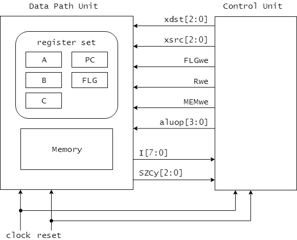

# CDECvのマイクロアーキテクチャ(概要)

CPUのハードウェア的な構造は、大きく分けてデータパス部(Data Path Unit)と制御部(Control Unit)の2つの要素で構成されます。
CDECvも図3.1に示すように、データパス部と制御部から構成されます。
制御部からデータパス部には制御信号(xdst, xsrc, FLGwe, Rwe, MEMwe, aluop)が送られています。
また、データパス部からは機械語命令のコード(I)やフラグ信号(SZCy)が送られています。
クロック信号clockとリセット信号resetは、データパス部と制御部の両方に共通して供給されます。

<図3.1 CDECvの全体的な構成(データパス部と制御部)>

データパス部はその名の通り、データをやり取りするための経路を実現した回路です。
データパス部には、汎用レジスタやフラグレジスタ、プログラムカウンタなどのレジスタセットとメモリが含まれ、
さらには算術論理演算を行うALUや、命令を実現するために必要な補助的なレジスタなども含まれます。
この経路に沿ってレジスタ同士やメモリとレジスタ間のデータ転送が行われたり、様々な算術論理演算が行われたりすることで、命令が実現されます。

データパス部の動作は制御部からの制御信号によって制御されます。
表3.1に制御部からの制御信号についての簡単な説明を示しました。
制御信号の働きの詳細については次章で説明します。

<表3.1 制御部からの制御信号>

| 制御信号   | 説明 |
|-----------|------|
| xdst[2:0] | データ転送元を指定 |
| xsrc[2:0] | データ転送先を指定 |
| FLGwe     | FLGレジスタへの書き込み許可   |
| Rwe       | 補助レジスタRへの書き込み許可 |
| MEMwe     | メモリへの書き込み許可        |
| aluop     | ALUの演算選択信号 |

制御部は制御信号を生成するための回路です。
命令を実現するためには適切なタイミングで適切な制御信号を生成し、データパス部へ送る必要があります。
このような制御信号を生成する機構は状態機械(ステートマシン)で実現することができます。

どのような制御信号を生成するのかは、実行する命令によって変わってきます。
そのため、データパス部から機械語の命令コードやフラグ信号を受け取る必要があります(表3.2)。

<表3.2 データパス部からの信号>

| 信号 | 説明 |
|----------|----------------------------|
| I[7:0]   | 機械語命令のコード(1バイト目) |
| SZCy[2:0]| フラグ信号 |
