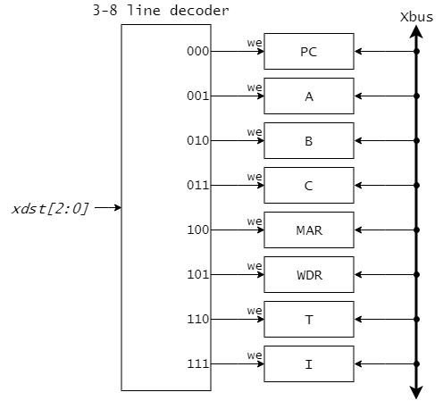

# CDECvのデータパス部の構成と動作

本章ではCDECvのデータパス部の回路構成について説明します。
また、制御部から送られてくる制御信号によって、データバス部の動作がどのように制御されるのかを確認します。

## データパス部の構成

CDECvのデータパス部の全体構成を図4.1に示します。
図4.1ではデータをやり取りするデータ線のみを示しており、制御信号やクロックなどの信号線は省略しています。

CDECvのデータパス部の特徴は、1本の8ビットのデータバスXbusを中心として構成されている点です。
このXbusを介して、データのやり取りが行われます。

データパス部には、プログラムカウンタ(PC)、汎用レジスタ(A, B, C)、フラグレジスタ(FLG)からなるレジスタセットとメモリ(256Byte)が含まれます。
さらに、算術論理演算を行うためのALUと、レジスタセット以外の各種レジスタが含まれています。

ALUには2章で説明した図2.8に示したものを利用します。
このALUは4ビットの制御信号により表2.5のように様々な演算機能を切り替えることができます。

レジスタセット以外に用いられている補助レジスタとしては、WDR(Write Data Register)、MAR(Memory Address Register)、T(Temporary register)、R(Result register)、I(Instruction register)があります。
これらはすべて8ビットのレジスタです。
このうち、WDRはメモリへの書き込みデータ、MARはメモリのアドレス指定を保持するためのレジスタです。
TレジスタはALUで2項演算を行う際に一方の演算対象を格納するための用いられます(もう一方の演算対象はXbusから読みだされます)。
RレジスタはALUで実行された演算結果を保持するレジスタです。
Iレジスタは機械語命令の先頭バイトを格納するレジスタで、実行中の機械語命令の情報を制御部へ伝達します。

<図4.1 CDECvデータパス部の構成>

制御部から送られてくる制御信号によって、データバス部のやり取りがどのように制御されるのかを説明していきます。
なお、煩雑を避けるため、回路図ではレジスタやメモリに供給されるクロック信号clockの信号線は省略します。
すべてのレジスタとメモリにはクロックclockが共通に供給されており、clockの立ち上がりのタイミングでデータの読出しや書き込みが行われることに注意してください。

## Xbusを介したデータ転送

図4.1から見て取れるように、Xbusには6個のレジスタ PC, A, B, C, FLG, Rの出力(レジスタのq端子)とメモリの読出しデータの出力RDが接続されています。
また、Xbuxからは8個のレジスタ PC, A, B, C, I, WDR, MAR, Tの入力端子(レジスタのd端子)へ共通に接続されています。
これらの間でのデータ転送はXbusを介して行われます。

CDECvでは、Xbusを介したデータ転送は、データ転送元(データの読出し元)とデータ転送先レジスタ(データの書き込み先)をそれぞれ1つ選択して行われます。
制御部からの制御信号 xsrc[2:0] と xdst[2:0] はそれぞれ、データ転送元とデータ転送先レジスタを選択します。

制御信号 xsrc によりどのデータ転送元が選択されるかを表4.1に、制御信号 xdst によりどのデータ転送先が選択されるのかを表4.2に示します。

<表4.1 制御信号xsrc/データ転送元の対応>

| xsrc[2:0] | データ転送元 |
|-----------|-------|
| 000       | PC    |
| 001       | A     |
| 010       | B     |
| 011       | C     |
| 100       | R     |
| 101       | RD    |
| 110       | FLG   |
| 111       | 0xFF (定数値) |

<表4.2 制御信号xdst/データ転送先レジスタの対応>

| xdst[2:0] | データ転送元 |
|-----------|-------|
| 000       | PC    |
| 001       | A     |
| 010       | B     |
| 011       | C     |
| 100       | MAR   |
| 101       | WDR   |
| 110       | T     |
| 111       | I     |

データ転送元を選択する回路は図4.2のようにマルチプレクサを用いて構成されます。
制御信号xsrc[2:0]として000が与えられているときは、プログラムカウンタPCが保持してるデータが選択され、Xbusに出力されます。

データ転送先レジスタを選択する回路は図4.3のようにラインデコーダを用いて構成されます。
8個のレジスタの入力(レジスタのd端子)にはXbusが共通して入力されています。
制御信号xdst[2:0]として100が与えられているときは、MARの書き込み許可weが1となり、他のレジスタの書き込み許可weは0となります。
この状況でclockの立ち上がりが入るとXbusに出ているデータがMARに書き込まれます。

<図4.2 データ転送元の選択回路>

<図4.3 データ転送先レジスタの選択回路>

図4.4にプログラムカウンタPCからMARへデータが転送される様子を示したタイムチャートを示します。
データ転送元を選択する制御信号 xsrc[2:0] が000となっている間は、PCに保持されているデータがXbusに出力されます。
また、制御信号 xdst[2:0] が100となっている間はMARの書き込み許可が与えられています。
この間にclockの立ち上がりが入るとXbusに出ているデータ(すなわちPCのデータ)がMARに書き込まれます。
このようにしてPCからMARへのデータ転送(PC->MAR)が実現されます。

なお、CDECvのデータパス部でのレジスタの書き込みはクロック信号clockの立ち上がりのタイミングで行われますが、制御信号は半クロックずらして与えられるものとします。
このことにより、制御信号が安定している状況で確実にデータ転送を行うことができます。

<図4.4 Xbusを介したデータ転送(PC->MAR)>

## メモリへのアクセス

メモリへのアクセスには、図4.5のように、2つの補助レジスタMARとWDR、1ビットの制御信号MEMweが関与します。
MARはアクセスするメモリのアドレスを保持するためのレジスタで、MARの出力はメモリのMA端子に接続されています。
WDRはMARで指定されたアドレスへ書き込みを行うデータを保持しておくレジスタで、WDRの出力はメモリのWD端子へ接続されています。
制御部からの制御信号MEMweは、メモリの書き込み許可(we)を与えます。
メモリからの出力データRDは図4.2に示したようにマルチプレクサを介してXbusへ接続されています。

<図4.5 メモリへのアクセス回路>

図4.6にメモリの読出しシーケンスの例を示します。
ここではメモリの0x03番地RAM[0x03]に格納されているデータ0x83を読み出している状況を表しています。
まずアクセスしたいアドレス0x03をMARへ転送します。
先に説明したように、MARへの書き込みはclockの立ち上がりのタイミングで行われることに注意してください。
MARの値が確定されたのち、clockの立ち上がりがメモリに入ると、RAM[0x03]の値0x83がRDへ転送され出力されます。

<図4.6 メモリの読出しシーケンス>

図4.7はメモリへの書き込みシーケンスを示したものです。
アドレス0xA1番地RAM[0xA1]に、データ0x12を書き込む状況を表しています。
まず、MARにアドレス0xA1、WDRに書き込みたいデータ0x12を転送します。
MARとWDRの確定に2クロック必要とされることに注意してください（順番はどちらが先でも大丈夫です）。
MARとWDRの値が確定した段階で、メモリの書き込み許可MEMweをアクティブにします。
この間にclockの立ち上がりが入ると、WDRのデータがメモリの0xA1番地へ書き込まれます。

<図4.7 メモリの書き込みシーケンス>

<図4.8 ALUの制御回路>

<図4.9 制御部への信号>
