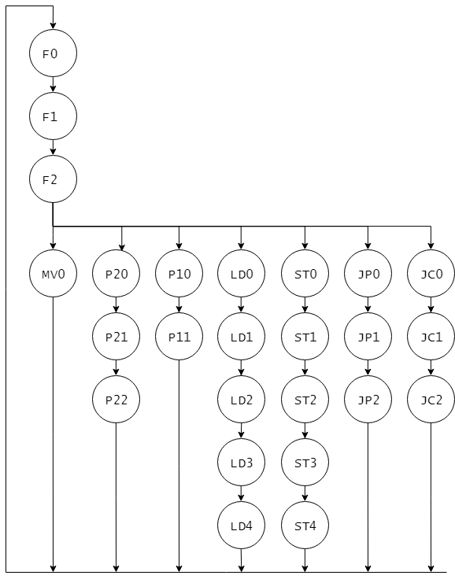

# CDECv標準命令の命令サイクル

CDECvでは、命令は1ステップ(1クロック)で行われるのではなく、複数のステップを経て実行されます。
一つの命令を実行するのに必要なすべてのステップは命令サイクル(Instruction Cycle)と呼ばれます。
この命令サイクルは、命令をメモリから取り出しどの命令を実行するのかを確定するまでのフェッチサイクル(Fetch Cycle)と、取り出した命令を実際に実行するまでの実行サイクル(Execute Cycle)とに分けられます。

CDECvの標準命令は図5.1に示す命令サイクルで行われます。
F0からF2はフェッチサイクルで、それ以降は実行サイクルです。
フェッチサイクルで行う処理は命令によらず同じですが、実行サイクルは命令によって行う処理が異なります。
そのため、命令の種類により、フェッチサイクルの最後のステップF2から実行サイクルへは分岐が生じます。
図5.1中の各ステップの名前とその意味を、表5.1に示します。

<図5.1 CDECv標準命令の命令サイクル>

<表5.1 CDECv標準命令の命令サイクルの各ステップ名>
| ステップ名 | 意味          | 該当する命令 |
|-----|---------------------|-|
| Fn  | Fetch cyle          | |
| MVn | Move                | MOV |
| P2n | 2-operand operation | ADD, ADC, SUB, SBB, AND, OR, EOR |
| P1n | 1-operand operation | INC, DEC, NOT |
| LDn | Load                | LD |
| STn | Store               | ST |
| JPn | Jump (no condition) | JMP |
| JCn | Conditional Jump    | JS, JZ, JC |

以下ではまず、フェッチサイクルの各ステップで行う処理について説明します。
その後、それぞれの実行サイクルの各ステップで行う処理について説明します。

## フェッチサイクルで行う処理

|ステップ|　Xbus | Memory | ALU |
|---|---|---|---|
| F0 | PC -> MAR |                | PC + 1 -> R |
| F1 | R -> PC   | MEM[MAR] -> RD |             |
| F2 | RD -> I   |                |             |
