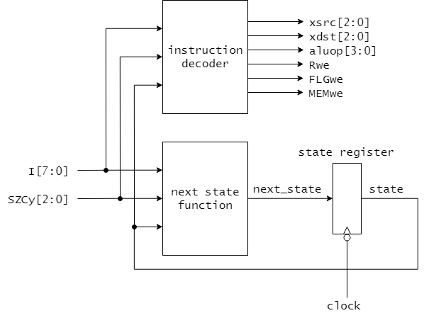

# 6章 CDECvの制御部の構成

制御部の役割は、5章でみてきた命令サイクルの各ステップの処理をデータパス部において実現できるよう、適切な制御信号を適切なタイミングで生成することです。
CDECvの制御部は、データパス部より命令コードI[7:0]とフラグ信号SZCy[2:0]を入力として受け取り、制御信号(xsrc[2:0], xdst[2:0], aluop[3:0], Rwe, FLGwe, MEMwe)を出力する有限状態機械(Finite State Machine, FSM)として実現できます。

## 制御部の構成

CDECvの制御部は、5章の図5.1に示したCDECv標準命令の命令サイクルを実現するような制御信号を生成しなければなりません。
したがって制御部は、図5.11において各ステップを状態とみなした状態遷移を実現する必要があります。
このような回路は、図6.1に示すミーリー型(Marly)の有限状態機械で構成できます。

<図6.1 CDECvの制御部を構成する有限状態機械>

この有限状態機械は、現在どの状態(実行ステップ)にあるか(現在の状態 state)を保持するための状態レジスタ(state register)、現在の状態と入力(I[7:0], SZCy[2:0])から次の状態(next_state)を生成する次状態関数回路(next state function)と、同じく現在の状態と入力から制御信号を生成する命令デコーダ回路(instruction decoder)から構成されます。このうち次状態関数回路と命令デコーダ回路は組み合わせ論理回路です。

なお、状態レジスタはclockの立下りエッジで書き込みが行われるものとします。
これは、制御信号の変わるタイミング(clockの立下りエッジ)とデータパス部でのデータ転送のタイミング(clockの立ち上がりエッジ)を0.5クロックずらすことで、制御信号が安定している状況でデータパス部でのデータ転送が確実に行えるようにするためです。

図6.1の有限状態機械を設計するには、状態を適切に符号化したうえで、次状態関数回路と命令デコーダ回路それぞれの入力と出力の関係を真理値表として定める必要があります。。

以下では、MOV命令を例として制御部の設計方法を説明します。

### 状態の符号化

状態レジスタは、状態遷移図に含まれるすべての状態それぞれを一意の符号であらわすことができるのに十分なビット幅が必要となります。
図5.11のCDECv標準命令の命令サイクルでは、フェッチサイクルと実行サイクルを合わせて25個の状態があります。
ここでは、これらの状態を表6.1に示すように8ビットで符号化するとして、状態レジスタのビット幅は8ビットと取りましょう。
なお、表6.1では一部の状態の符号化だけを示しています。
他の状態も同様に一意な符号となるように(互いにかぶらないように)符号化します。

状態レジスタには、符号化された状態のビット列が保持され、現在の状態(state)が表されます。

<表6.1 状態の符号化(一部)>

|状態|符号        |
|----|------------|
|F0  | `00010000` |
|F1  | `00010001` |
|F2  | `00010010` |
|MV0 | `00100000` |
|P20 | `00110000` |
|P21 | `00110001` |
|P22 | `00110010` |

### 次状態関数回路の設計

次状態関数回路は現在の状態(state)と、機械語の命令コード(I[7:0])およびフラグ信号(SZCy[2:0])を入力として、次の状態(next_state)を出力する組み合わせ論理回路です。

MOV命令を行うには、図5.1の命令サイクルのうち、F0 -> F1 -> F2 -> M0 -> F0 という状態遷移を実現する必要があります。
そのためには、次状態関数回路は表6.2に示される真理値表を満たさなければなりません。
表6.2において、入力は state, I, SZCy で、出力は next_state です。
備考には表6.1と照らし合わせてどのような状態遷移を表しているかを示しています。
なお、表中I[7:0]やSZCy[3:0]の欄に現れるxは、出力(すなわち next_state )が、そのビットに依存せずに決まることを示しています。

<表6.2 次状態関数回路の真理値表(一部)>

| state      | I[7:0] | SZCy[2:0] | next_state | 備考     |
|------------|------------|-------|------------|----------|
| `00010000` | `xxxxxxxx` | `xxx` | `00010001` | F0 -> F1 |
| `00010001` | `xxxxxxxx` | `xxx` | `00010010` | F1 -> F2 |
| `00010010` | `0000xxxx` | `xxx` | `00100000` | F2 -> MV0|
| `00100000` | `xxxxxxxx` | `xxx` | `00010000` | MV0 -> F0|

表の1段目および2段目はそれぞれ、フェッチサイクルでの状態遷移 F0 -> F1 と
F1 -> F2 を実現するものです。
フェッチサイクルでの状態遷移は命令 I やフラグ SZCy に依存しません。

3段目はフェッチサイクルからMOV命令の実行サイクルへの遷移 F2 -> MV0 を実現します。
実行サイクルへの遷移は命令により分岐が生じます。
1章の表1.1によると、MOV命令の命令コードは `0000ssdd` でした。
そこで、I[7:0]に `0000xxxx` を指定することで、MOV命令の場合に次の状態(next_state)として MV0 に遷移できるようにしています。

最後の4段目はMOV命令を終了し次の命令のフェッチサイクルへ移る遷移 MV0 -> F0 を実現します。

さて、表6.2では次状態関数回路の真理値表のうち、MOV命令の状態遷移を実現する部分が示されています。
他の命令に対しても同様に状態遷移を実現する真理値表を検討し組み合わせることで、次状態関数回路の完全な真理値表が作成できます。

### 命令デコーダ回路の設計

命令デコーダ回路は、現在の状態(state)と、機械語の命令コード(I[7:0])およびフラグ信号(SZCy[2:0])を入力として、制御信号を出力する組み合わせ論理回路です。
制御信号として出力されるのは、Xbusでのデータ転送の転送元を指定する xsrc[2:0] (4章 表4.1)と転送先を指定する xdst[2:0] (4章 表4.2)、ALUで行う演算を指定する aluop[3:0] (4章 表4.3)、Rレジスタの書き込み許可 Rwe、FLGレジスタの書き込み許可 FLGwe、そしてメモリ書き込み許可 MEMwe になります。

命令デコーダ回路は命令サイクルの各状態において、5章の表5.2から表5.9で見た来たような処理をデータパス部で実現できるような制御信号を出力しなければなりません。
それでは、MOV命令のフェッチサイクル(F0, F1, F2)と実行サイクル(MV0)の各状態に対して、どのような制御信号を出力させるのかを見ていきましょう。
命令デコーダ回路の真理値表のうち、MOV命令を実現するのに必要な部分を表6.3に示します。

<表6.3 命令デコーダ回路の真理値表(一部)>

| state | I[7:0] | SZCy[2:0] | xsrc[2:0] | xdst[2:0] | aluop[3:0] | Rwe | FLGwe | MEMwe | 備考 |
|------------|------------|-------|------------|----------|
| `00010000` | `xxxxxxxx` | `xxx` | `000` | `100` | `1000` | `1` | `0` | `0` | F0: MAR <- PC, R <- PC+1 |
| `00010001` | `xxxxxxxx` | `xxx` | `100` | `000` | `0111` | `0` | `0` | `0` | F1: PC <- R |
| `00010010` | `xxxxxxxx` | `xxx` | `101` | `111` | `0111` | `0` | `0` | `0` | F2: I <- MAR |
| `00100000` | `00000101` | `xxx` | `001` | `001` | `0111` | `0` | `0` | `0` | MV0: A <- A (MOV A, A) |
| `00100000` | `00000110` | `xxx` | `001` | `010` | `0111` | `0` | `0` | `0` | MV0: B <- A (MOV A, B) |
| `00100000` | `00000101` | `xxx` | `001` | `011` | `0111` | `0` | `0` | `0` | MV0: C <- A (MOV A, C) |
| `00100000` | `00001001` | `xxx` | `010` | `001` | `0111` | `0` | `0` | `0` | MV0: A <- B (MOV B, A) |
| `00100000` | `00001010` | `xxx` | `010` | `010` | `0111` | `0` | `0` | `0` | MV0: B <- B (MOV B, B) |
| `00100000` | `00001001` | `xxx` | `010` | `011` | `0111` | `0` | `0` | `0` | MV0: C <- B (MOV B, C) |
| `00100000` | `00001101` | `xxx` | `010` | `001` | `0111` | `0` | `0` | `0` | MV0: A <- C (MOV C, A) |
| `00100000` | `00001110` | `xxx` | `010` | `010` | `0111` | `0` | `0` | `0` | MV0: B <- C (MOV C, B) |
| `00100000` | `00001101` | `xxx` | `010` | `011` | `0111` | `0` | `0` | `0` | MV0: C <- C (MOV C, C) |

表6.3の1段目から3段目はそれぞれフェッチサイクルの F0, F1, F2 において、どのような制御信号を出力するのかを示しています。
5章の表5.2に示した、フェッチサイクルの各ステップで行う処理が実際に実現できることを確かめてください。

表の4段目から12段目はMOV命令の実行サイクルの状態 MV0 での制御信号を示しています。
MV0に相当するのが9段あるのは、MOV命令 `MOV sreg, dreg` において、転送元 sreg と転送先 dreg の汎用レジスタ(A, B, C)の選び方の組み合わせが、9通りあるためです。
例えば I[7:0]として`00000110`が指定されている5段目は、`MOV A, B` すなわち A レジスタからBレジスタへのデータ転送を実現するために必要な制御信号の出力を示しています。
xsrc[2:0]としてAレジスタを示す `001`、xdst[2:0]としてBレジスタを示す `010` が指定されており、確かに、Xbusを介して A レジスタから B レジスタにデータが転送されることがわかります。

以上ではMOV命令のみを見てきましたが、他の命令についても同様に命令デコーダの入出力の関係を検討し真理値表を組み合わせることで、完全な命令デコーダの真理値表が作成できます。
